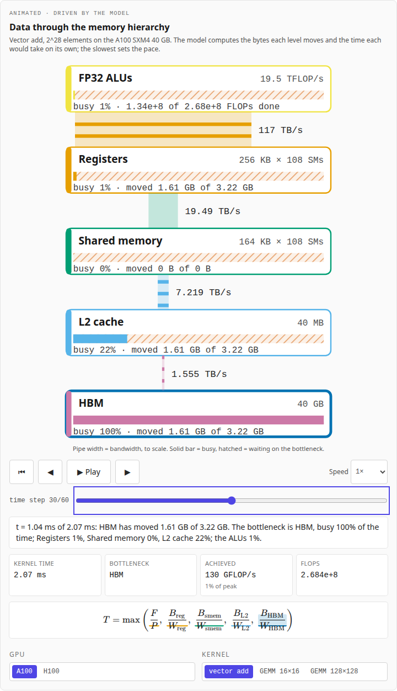
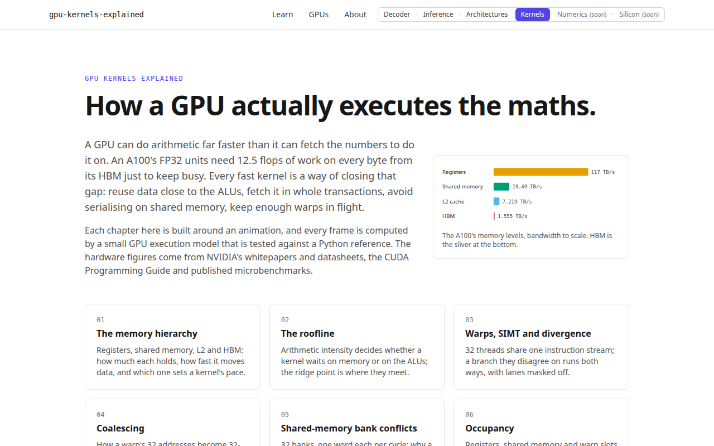
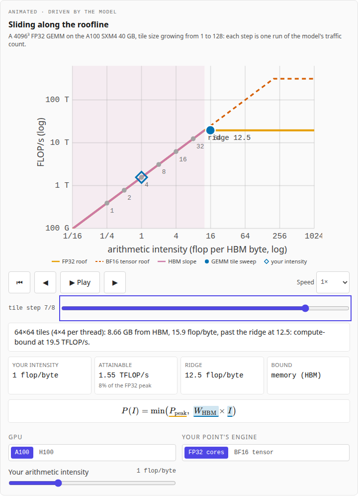
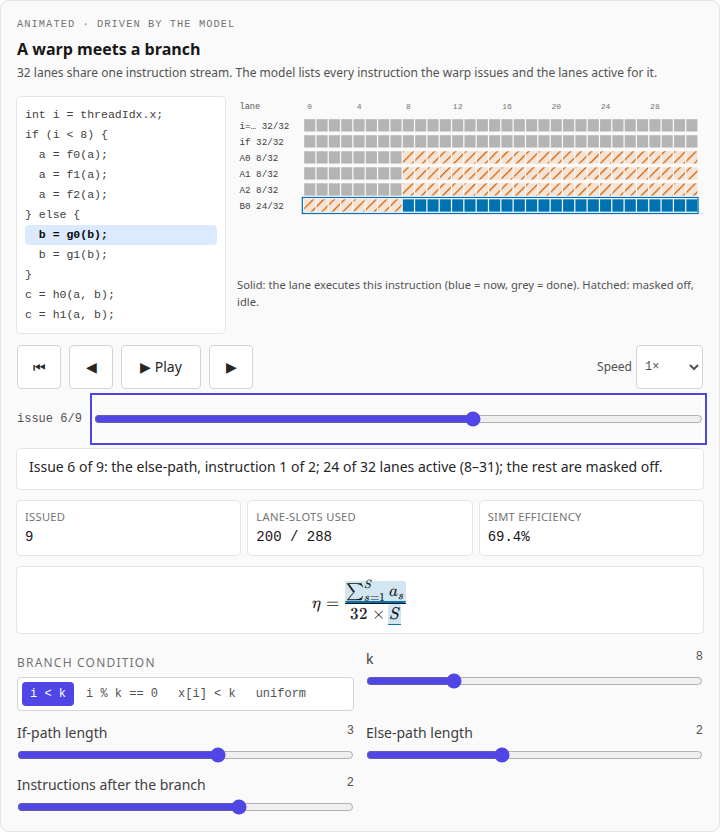
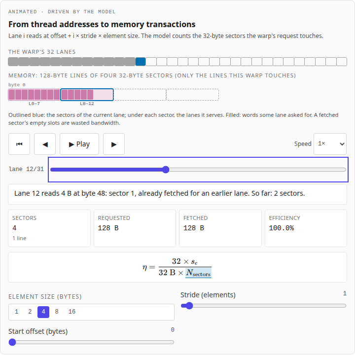
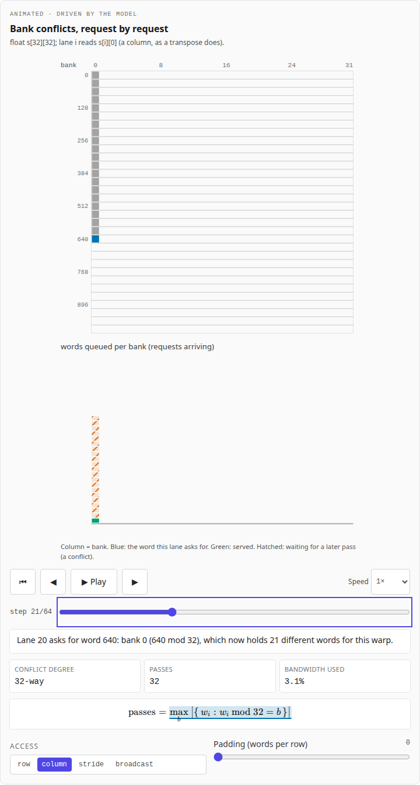
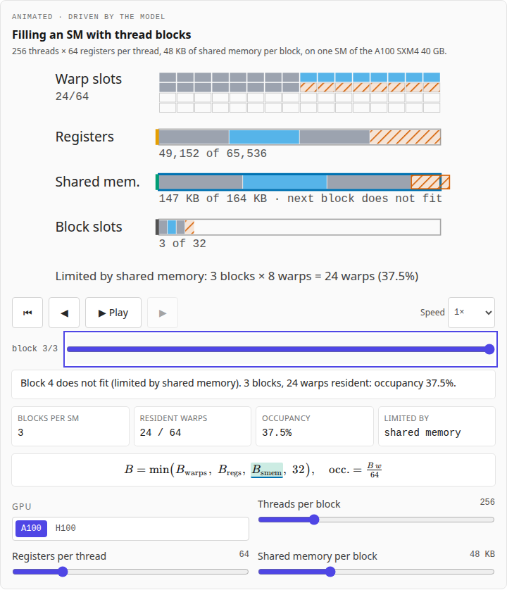

# GPU Kernels Explained

An animated explainer of how a GPU actually executes the maths: the memory
hierarchy, the roofline, warps and divergence, coalescing, shared-memory
bank conflicts and occupancy. Every chapter is built around an animation,
and every frame of every animation is computed by a small **GPU execution
model** whose TypeScript port matches its Python reference exactly. Every
hardware figure comes from a published source.

It is the fourth of a family of companion sites: the
[Transformer Decoder Explainer](https://transformer-decoder-explained.vercel.app/)
shows one forward pass, [LLM Inference Explained](https://llm-inference-explained.vercel.app/)
shows how a model is served, [LLM Architectures Explained](https://llm-architectures-explained.vercel.app/)
shows how the models differ, and this site is the layer underneath: the
kernels. They share one design system and link to each other from the
header ("Decoder · Inference · Architectures · Kernels · Numerics ·
Silicon"; the last two are coming).

**Live:** [gpu-kernels-explained.vercel.app](https://gpu-kernels-explained.vercel.app/)



## Part of

This project sits in the [LLMs](https://github.com/BrendanJamesLynskey/LLMs)
hub, next to the
[Transformer Decoder Explainer](https://github.com/BrendanJamesLynskey/transformer-explainer),
[LLM Inference Explained](https://github.com/BrendanJamesLynskey/llm-inference-explained)
and [LLM Architectures Explained](https://github.com/BrendanJamesLynskey/llm-architectures-explained).
Every chapter links the matching slides of the
[NVIDIA GPU Architectures](https://brendanjameslynskey.github.io/LLM_Hub_NVIDIA_GPUs/)
and [CUDA Programming](https://brendanjameslynskey.github.io/LLM_Hub_CUDA/)
series.

## Chapters

| #   | Chapter                                                                                              | The animation                                                                                                                                                            |
| --- | ---------------------------------------------------------------------------------------------------- | ------------------------------------------------------------------------------------------------------------------------------------------------------------------------ |
| 01  | [The memory hierarchy](https://gpu-kernels-explained.vercel.app/learn/01-memory-hierarchy)           | Data flows HBM → L2 → shared memory → registers → ALUs; pipe widths are bandwidths to scale, packets move at each level's real use. Vector add, two GEMMs, A100 or H100. |
| 02  | [The roofline](https://gpu-kernels-explained.vercel.app/learn/02-roofline)                           | A GEMM's tile size grows from 1 to 128 and its point slides from the memory-bound slope onto the roof; a slider places any intensity.                                    |
| 03  | [Warps, SIMT and divergence](https://gpu-kernels-explained.vercel.app/learn/03-warps-and-divergence) | A warp issues every instruction of both paths of a branch, with lanes masked off; four kinds of condition.                                                               |
| 04  | [Coalescing](https://gpu-kernels-explained.vercel.app/learn/04-coalescing)                           | Each lane's address maps to 32-byte sectors; stride, alignment and element size are adjustable.                                                                          |
| 05  | [Shared-memory bank conflicts](https://gpu-kernels-explained.vercel.app/learn/05-bank-conflicts)     | A 32-bank heat map fills request by request, then drains pass by pass; one word of padding fixes the transpose live.                                                     |
| 06  | [Occupancy](https://gpu-kernels-explained.vercel.app/learn/06-occupancy)                             | Thread blocks land on an SM until warp slots, registers or shared memory run out; sliders for each.                                                                      |

Chapters 7–11 (GEMM step by step, reductions and warp shuffles, softmax and
FlashAttention, split-K and overlap, quantised kernels) are next.

## Screenshots

|                                                           |                                                   |
| --------------------------------------------------------- | ------------------------------------------------- |
|                |  |
|    |  |
|  |    |

Regenerate them with `pnpm build && pnpm start` in one shell and
`pnpm screenshots` in another.

## The execution model

[`reference/gpu_model.py`](reference/gpu_model.py) is an **illustrative,
parameterised** model of a GPU, not a cycle-accurate simulator. A GPU is a
set of figures (SM count, clock, FP32 and tensor peaks, warps, registers,
shared memory with 32 banks, L2 and HBM bandwidths and sizes, tensor-core
tile shapes, measured latencies). For a kernel configuration the model
computes:

- the **bytes moved at each memory level** (registers, shared memory, L2,
  HBM) for element-wise kernels and tiled GEMMs, and the kernel time as a
  hierarchical roofline (the slowest level sets the pace);
- **arithmetic intensity** and the **roofline** position, for the FP32
  units and the BF16 tensor cores;
- **occupancy**, by the rules of the CUDA Toolkit's `cuda_occupancy.h`
  (register and shared-memory allocation granules, the reserved kilobyte,
  the block limit);
- **bank conflicts** for an access pattern, with broadcast;
- **coalescing**: the 32-byte sectors a warp's request touches;
- **SIMT divergence**: the active mask of every instruction a warp issues;
- a **load / compute / store timeline** per tile, single- or multi-buffered.

The functions that drive the animations return a list of states; a frame on
the site is a pure function of one state.

### Presets and sources

Two presets ship, **A100 SXM4 40 GB** and **H100 SXM5 80 GB**. Every figure
has a status (`spec`, `rule`, `measured`, `derived` or `approximation`)
and a source with the table or page; the site lists them all at
[`/gpus`](https://gpu-kernels-explained.vercel.app/gpus). The sources:
NVIDIA's [A100](https://images.nvidia.com/aem-dam/en-zz/Solutions/data-center/nvidia-ampere-architecture-whitepaper.pdf)
and [H100](https://resources.nvidia.com/en-us-tensor-core/gtc22-whitepaper-hopper)
architecture whitepapers, the [H100 product page](https://www.nvidia.com/en-us/data-center/h100/),
the [CUDA Programming Guide](https://docs.nvidia.com/cuda/cuda-programming-guide/),
the CUDA Toolkit's `cuda_occupancy.h`, the [PTX ISA](https://docs.nvidia.com/cuda/parallel-thread-execution/index.html)
(tensor-core shapes), and Luo et al.,
[Benchmarking and Dissecting the Nvidia Hopper GPU Architecture](https://arxiv.org/abs/2402.13499)
(measured latencies and the H100's L2 bandwidth, which NVIDIA does not
publish). Derived figures and their formulas:

- shared memory: SMs × 32 banks × 4 bytes × clock;
- L2: bytes per clock × clock;
- registers: 6 bytes per flop × the FP32 peak (three 4-byte operands per
  two-flop FFMA);
- the H100's clock: its FP32 peak ÷ (2 × FP32 cores).

**Illustrative, and labelled so on the site:** the kernel-time model (every
level at peak, perfectly overlapped; a GEMM's matrices either fit in L2 or
every load misses it; latency ignored), the H100's L2 bandwidth (measured on
an H800, the same die), the classic SIMT path order (Volta and later may
order the paths differently, at the same cost) and the occupancy carveout
(set to its maximum).

### Checked

- [`tests/python/test_gpu_model.py`](tests/python/test_gpu_model.py)
  checks the reference against its sources' worked examples: the CUDA
  Programming Guide's 4-sector and 12.5% coalescing cases, its two-way and
  32-way bank conflicts and the padding fix, its 75% and 50% occupancy
  examples, and the GEMM traffic closed forms.
- [`src/lib/gpu/model.ts`](src/lib/gpu/model.ts) repeats every function with
  the same operations in the same order.
  [`scripts/make_fixtures.py`](scripts/make_fixtures.py) writes the
  reference's results over grids of every parameter (3,744 occupancy
  configurations, 180 coalescing patterns, 44 bank patterns, 72 branch
  traces, every animation's states), and
  [`tests/unit/model.test.ts`](tests/unit/model.test.ts) requires the port
  to reproduce **every value exactly**, no tolerance. CI fails if the
  fixtures are out of date.
- **Frame tests**: [`tests/unit/frames.test.ts`](tests/unit/frames.test.ts)
  and [`tests/e2e/frames.spec.ts`](tests/e2e/frames.spec.ts) set key frames
  of every animation and require the state, and the caption on the page, to
  match the ones built from the Python reference's state.
- Numbers in the chapters are printed from the model at build time
  (`<V of="a100.bw.smem" />`), and every code block shown is cut from the
  model's source ([`content.test.ts`](tests/unit/content.test.ts)); the two
  CUDA snippets are labelled as not compiled here (CI has no GPU).

## The animations

Every animation follows the family's visual standard:
play and pause, step back and forward, a scrub bar, speed from 0.25× to 4×
and reset; Space and the arrow keys when it has focus; a live caption per
step, also in an `aria-live` region; no auto-play with
`prefers-reduced-motion`; paused when scrolled out of view
(IntersectionObserver); the equation beside the picture, with the term the
animation is on highlighted (and hovering a term highlights the picture).
Colours are Okabe and Ito's colour-blind-safe palette, one colour per memory
level (registers orange, shared memory green, L2 sky blue, HBM purple), the
same in light and dark mode; a stall is a warning hue **and** a hatch.

The animations are plain SVG and HTML drawn by React from the model's
states, with a `requestAnimationFrame` clock ([`src/lib/anim/clock.ts`](src/lib/anim/clock.ts),
pure and unit-tested). No animation library and no D3: the pictures have at
most a few thousand elements, the scales are linear or logarithmic, and the
companion sites draw their charts the same way.

## Stack

The same stack as the companion sites, minus the backend:

- **Framework**: Next.js 14 (App Router) + TypeScript (strict)
- **Styling**: Tailwind CSS, Tailwind plugin for ESLint + Prettier
- **Content**: MDX via `next-mdx-remote`, KaTeX rendered on the server
- **Model**: Python reference, TypeScript port, JSON fixtures
- **Testing**: pytest, Vitest (exact parity, frames, content; 100% line
  coverage on `src/lib/gpu/`), Playwright (every page at 1280 and 390 px,
  light and dark; every animation's controls; frame tests; reduced motion;
  axe-core scans)
- **CI / deploy**: GitHub Actions (model and fixtures, lint, typecheck,
  unit, e2e, Lighthouse), Vercel

No database and no sign-in: every page is statically rendered, and each
animation is a code-split client component.

### Design system: where each piece came from

Copied from [llm-architectures-explained](https://github.com/BrendanJamesLynskey/llm-architectures-explained)
at commit `7b02ec6`, which copied it from the inference site and the
explainer:

| Here                                                                                                                                               | From                                                                                          |
| -------------------------------------------------------------------------------------------------------------------------------------------------- | --------------------------------------------------------------------------------------------- |
| `tailwind.config.ts`, `src/app/globals.css`, `src/app/layout.tsx`                                                                                  | identical apart from titles; `globals.css` adds the equation-highlight rules                  |
| `src/components/ui/SiteHeader.tsx`                                                                                                                 | the same header; new navigation links                                                         |
| `src/components/ui/SiteSwitch.tsx`                                                                                                                 | **redesigned** for six sites: a full row from `sm` up, a `<details>` dropdown on phones       |
| `src/app/learn/`, `src/lib/mdx/`, `Layer.tsx`, `LayerToggle.tsx`, `MdxTable.tsx`                                                                   | copied; `MdxTable.tsx` adds a focusable `pre`, the chapter page makes display maths focusable |
| `src/components/ui/Controls.tsx`, `Callout.tsx`                                                                                                    | unchanged (the animation panel takes the place of `WidgetFrame.tsx`)                          |
| `.eslintrc.json`, `.prettierrc.json`, `tsconfig.json`, `vitest.config.ts`, `playwright.config.ts`, `lighthouserc.json`, `.github/workflows/ci.yml` | adapted (model job, new pages)                                                                |
| `scripts/smoke-check.ts`, `scripts/capture-screenshots.ts`, `RUNBOOK.md`                                                                           | adapted                                                                                       |

New here: the animation clock, hook and panel (`src/lib/anim/`,
`src/components/anim/`), the family palette (`src/lib/viz/palette.ts`) and
the server-rendered equation component (`src/components/mdx/Eq.tsx`). A
shared npm package for the design system would be cleaner in principle;
for a handful of small sites, copying and recording the origin stays
simpler.

## Local development

- Node ≥ 20.11 and pnpm ≥ 9 (pinned via `packageManager`); Python ≥ 3.10.
- No environment variables, no database.

```bash
git clone https://github.com/BrendanJamesLynskey/gpu-kernels-explained
cd gpu-kernels-explained
pnpm install
python3 -m venv .venv && .venv/bin/pip install -r reference/requirements.txt
pnpm dev                              # http://localhost:3000
```

## Changing the model

```bash
# edit reference/gpu_model.py, then the same change in src/lib/gpu/model.ts
.venv/bin/python -m pytest tests/python      # the reference's closed forms
.venv/bin/python scripts/make_fixtures.py    # regenerate src/data and the fixtures
pnpm test                                    # the port must match exactly
```

## Testing

```bash
.venv/bin/python -m pytest tests/python   # reference model
pnpm lint && pnpm typecheck && pnpm format:check
pnpm test:coverage                        # Vitest with thresholds (exact parity included)
pnpm test:e2e                             # Playwright on a production build (builds first)
pnpm lighthouse                           # Lighthouse CI on a `pnpm build`
pnpm smoke <url>                          # post-deploy check of every page
```

## Deploying

See [`RUNBOOK.md`](RUNBOOK.md): a CLI deploy from a clean `git archive`
export, then `pnpm smoke`.

## Project layout

```
content/chapters/     The MDX chapters, each opening with its animation
reference/            The Python GPU execution model
scripts/              make_fixtures, smoke-check, capture-screenshots
src/app/              Routes: /, /learn, /learn/[slug], /gpus, /about
src/lib/gpu/          The TypeScript model, the captions, the values the prose quotes
src/lib/anim/         The animation clock
src/data/             Presets and sources (generated by make_fixtures.py)
src/components/anim/  The animation hook and panel (controls, caption, equation)
src/components/interactive/  One widget per chapter
tests/python/         pytest
tests/unit/           Vitest (fixtures in tests/fixtures/)
tests/e2e/            Playwright + axe-core
```

## References

- NVIDIA, [A100 Tensor Core GPU Architecture](https://images.nvidia.com/aem-dam/en-zz/Solutions/data-center/nvidia-ampere-architecture-whitepaper.pdf) and [H100 Tensor Core GPU Architecture](https://resources.nvidia.com/en-us-tensor-core/gtc22-whitepaper-hopper) (whitepapers).
- NVIDIA, [CUDA Programming Guide](https://docs.nvidia.com/cuda/cuda-programming-guide/) and [Nsight Compute Profiling Guide](https://docs.nvidia.com/nsight-compute/ProfilingGuide/index.html).
- Williams, Waterman and Patterson, 2009 — _Roofline: an insightful visual performance model for multicore architectures_, [doi:10.1145/1498765.1498785](https://doi.org/10.1145/1498765.1498785).
- Luo et al., 2024 — _[Benchmarking and Dissecting the Nvidia Hopper GPU Architecture](https://arxiv.org/abs/2402.13499)_.
- Okabe and Ito, 2008 — _[Color Universal Design](https://jfly.uni-koeln.de/color/)_ (the palette).

## Contributing

PRs welcome. CI runs the model job (fixtures up to date, pytest),
`format:check`, `lint`, `typecheck`, unit tests with coverage thresholds,
e2e on a production build, and Lighthouse CI (performance, accessibility
and best practices must each score at least 90 on `/`, `/gpus` and three
chapters).

## Licence

MIT — see [`LICENSE`](LICENSE).
